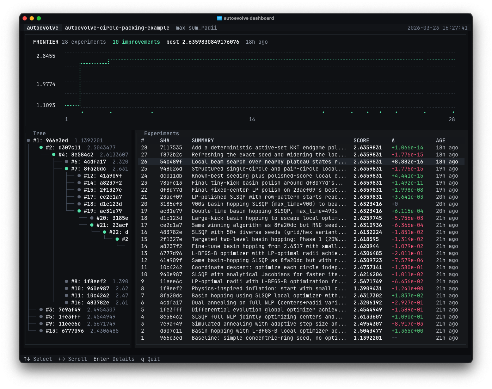

# autoevolve



`autoevolve` lets your coding agents run simple git-backed experiment loops.

Run it inside an existing project, let it set up the files your coding agent needs, and then watch your agent(s) iterate and branch through different experiments autonomously.

## Install

```bash
pip install autoevolve
```

## Quickstart

Initialize `autoevolve` in an existing git repo:

```bash
autoevolve init
```

`autoevolve init` walks you through the setup for your coding harness and problem:

- `SKILL.md` or `PROGRAM.md`: the instructions your coding agent reads to use `autoevolve`
- `PROBLEM.md`: the goal, metric, constraints, and validation setup for your problem

Tell your agent to read `PROGRAM.md` or activate the skill depending on your setup:

```
Read PROGRAM.md, then start working.

# If using skills
$autoevolve  # Codex
/autoevolve  # Claude Code
```

From there, your agent should start working in the repo as usual. Experiment commits will include:

- `EXPERIMENT.json`: the structured record of the experiment, including summary, metrics, and any references to other experiments
- `JOURNAL.md`: the narrative record of the experiment, which could include the hypothesis, changes made, outcomes, reflections, etc.

Start the TUI to monitor your agent's progress:

```bash
autoevolve dashboard
```

## CLI

Here’s the CLI surface: `Human` commands handle setup and monitoring, `Lifecycle` manages experiments, and `Inspect` and `Analytics` help your agents review the experiment state.

```
Usage: autoevolve [OPTIONS] COMMAND [ARGS]...

  Git-backed experiment loops for coding agents.

Options:
  --help  Show this message and exit.

Human:
  init       Set up PROBLEM.md and agent instructions.
  validate   Check that the repo is ready for autoevolve.
  update     Update detected prompt files to the latest version.
  dashboard  Open the experiment dashboard.

Lifecycle:
  start      Create a managed experiment branch and worktree.
  record     Validate, commit, and remove the current managed worktree.
  clean      Remove stale managed worktrees for this repository.

Inspect:
  status     Show the current experiment status.
  log        Show experiment logs.
  show       Show experiment details.
  compare    Compare two experiments.
  lineage    Show experiment lineage around one ref.

Analytics:
  recent     List the most recent recorded experiments.
  best       List the top experiments for one metric.
  pareto     List the Pareto frontier for selected metrics.

Examples:
  autoevolve start tune-thresholds "Try a tighter threshold sweep" --from 07f1844
  autoevolve record
  autoevolve log
  autoevolve recent --limit 5
  autoevolve best --max benchmark_score --limit 5

Run "autoevolve <command> --help" for command-specific details.
```
